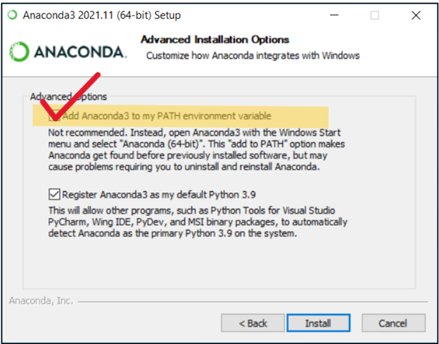

# Installation  

There are a many different flavors of Python, but the [Anaconda Python distribution](https://docs.anaconda.com/) is very popular among the data science community. We recommend installing Anaconda, as it comes with many popular data science libraries as well as a built in package manager, Conda.  

This workshop presumes you have the [Anaconda distribution installed](https://docs.anaconda.com/anaconda/install/).

## Installation instructions  

1. Go to the [Anaconda installation page](https://docs.anaconda.com/anaconda/install/), and choose your operating system.

2. After choosing your operating system, download the installer on the following page and follow the instructions.

3. During the installation process, keep all of the default options, ***EXCEPT* be sure to check the box to Add Anaconda to the PATH environment variable.**  

 

Yes, we know Anaconda does not recommend this, but there are advantages of adding it to your PATH for beginners. If you already have Anaconda, or are experienced with this type of thing, you *can* skip this, you just may not be able to launch some of these applications from your command line.
{: .note}

4. Proceed through the remaining installation steps keeping everything else as default.  

5. Once the installation has finished, navigate to your apps directory. You should have Anaconda Navigator and several associated apps installed. 