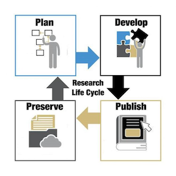
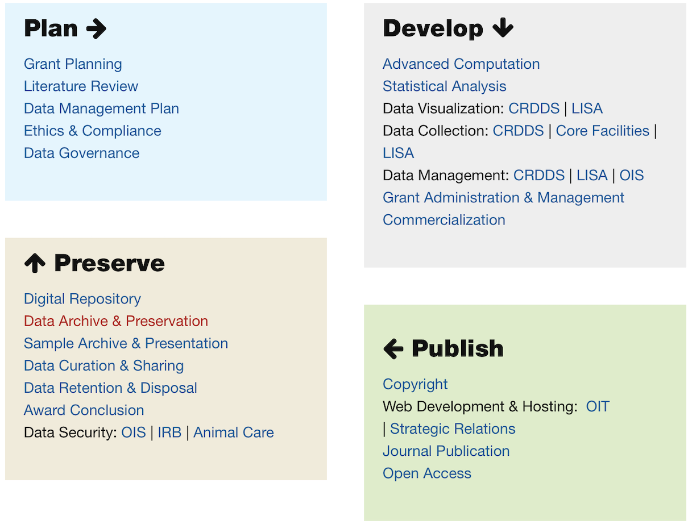

# Research Data Foundations Camp Overview

Welcome to the August 2025 Research Data Foundations Camp. The Camp is sponsored and organized by the [Center for Research Data and Digital Scholarship (CRDDS)](https://www.colorado.edu/crdds/) at the University of Colorado Boulder.

It is likely that you will work with research data at some point during the course of your respective graduate programs. The goal of this Research Data Camp is to provide you with an overview of some of the skills, strategies, and best practices that will help you to get started in pursuing this kind of work. The Camp does not presuppose any prior experience in working with research data, and all of the sessions are introductory in nature. Our purpose is not to help you master any given topic, but to provide a useful and productive starting point for further exploration and learning. As you explore further after the Camp and into the semester, we hope you'll make use of your campus's many resources, such as opportunities for individual consultations and workshops (many of which will cover the material introduced here in greater depth). More information about these opportunities is provided on the CRDDS and CSU websites.

In thinking about the various skills and tasks that are relevant to projects that involve research data, librarians and data professionals often think in terms of a heuristic called the research data lifecycle:

The lifecycle model specifies, in broad terms, the distinct yet interconnected stages of a data-intensive research project; each stage involves a variety of more specific tasks and competencies, as represented in the following graphic from the CRDDS [website](https://www.colorado.edu/crdds/what-we-do/research-lifecycle):

By attending the Camp, our hope is that you will be empowered to navigate the research data lifecycle with respect to your own work, in a deliberate and intentional way.

The different sessions of the Research Data Camp address themselves to various stages of this research data lifecycle (italicized words correspond to the stage(s) of the research data lifecycle that the session will emphasize).

* **Data Discovery** will provide you with an introduction to basic strategies for finding data that is relevant to your research needs, and explore basic principles of data ethics that you should consider when working with research data. (*Plan; Develop; Publish; Preserve*)
* **GitHub and GitHub Pages** will explore how you can use GitHub and GitHub pages as platforms to collaborate with others, and to share and disseminate your work (*Publish; Preserve*)
* **Data Ethics** will discuss basic principles of data ethics, with the goal of empowering you to use and create research data in an ethical and responsible manner. (*Plan; Develop; Publish; Preserve*)
* **Data Management** will explore basic principles of data management and introduce tools for data management and storage. (*Plan; Develop; Preserve*)
* **Interdisciplinary Tools Tour** will survey various useful data-related tools for interdisciplinary research.  (*Plan; Develop; Publish; Preserve*)
* **Data Publishing and Repositories** will discuss basic principles of scholarly communication as they relate to data research,and best practices for data archiving. (*Plan; Publish; Preserve*)
* **Data Analysis in R** aims to introduce R novices to useful principles, tools, and packages for data-based research in R/R Studio. (*Develop*)
* **Python Fundamentals** will cover the fundamentals of the Python programming language introduce you to the use of Python for data-based research.(*Develop*)

We will conclude the Research Data Camp by discussing how you can continue your learning about the various topics introduced at the Camp by participating in CRDDS programs and activities during the next semester and beyond. We will also discuss the details of the Research Data Camp microcredential, which you can earn by completing a small project that demonstrates your familiarity with the topics presented over the course of the Camp. 
